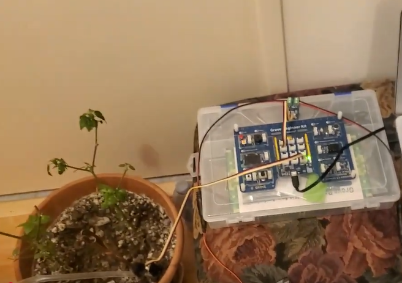

# Plant Watering System

This project was created for the EECS1021 Object Oriented Programming course from Sensors to Actuators at York University, Toronto, Canada. 

I used the firmata4j firmware with an Arduino Uno board to control a capacitive moisture sensor and a pump to monitor the moisture level of a plant, and open a water valve
if the moisture level is too low. I also used the edu.princeton.cs.introcs.StdDraw package to create a moisture graph, so the moisture level can also be monitored by a user.

The project was intended to be used as an education and assessment tool only. The video demonstration of the project can be seen in the following link [https://www.youtube.com/watch?si=b8xfoCtHZS__AAA1&v=ajDVEePGOGo&feature=youtu.be](https://www.youtube.com/watch?v=9GGUeIOOtuc)

# Video Demo

## 🛠️ Technologies & Tools

- Programmed a dynamic plant-watering system using **Java** and the **Firmata4j** library for real-time MCU communication  
- Visualized soil moisture levels using **`StdDraw`** from Princeton's `introcs` package  
- Used **Arduino IDE** to upload Firmata firmware to the MCU  
- Employed **Git CLI** for source control and **JetBrains** for Java code editing

## 🧱 Hardware Platform
- 🔌 **Microcontroller:** [Arduino Uno R3](https://store.arduino.cc/products/arduino-uno-rev3) (ATmega328P)  
- 🌱 **Sensor:** Soil moisture sensor with analog output  
- 💧 **Actuator:** Water pump module 
- 🔁 **Communication:** Serial over USB using **StandardFirmata** protocol  

> The system monitors soil moisture in real time and activates the watering system only when moisture falls below a threshold. Ideal for automating plant care in small-scale environments.

## License

